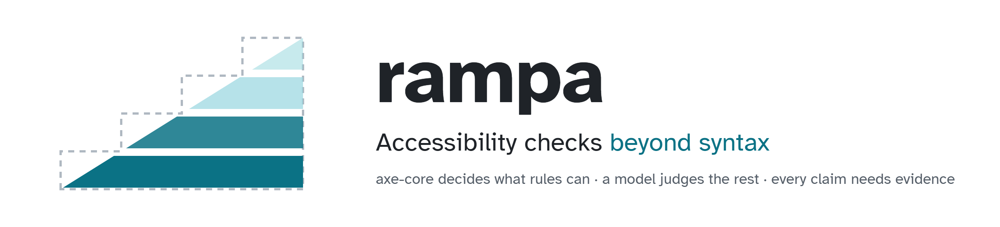
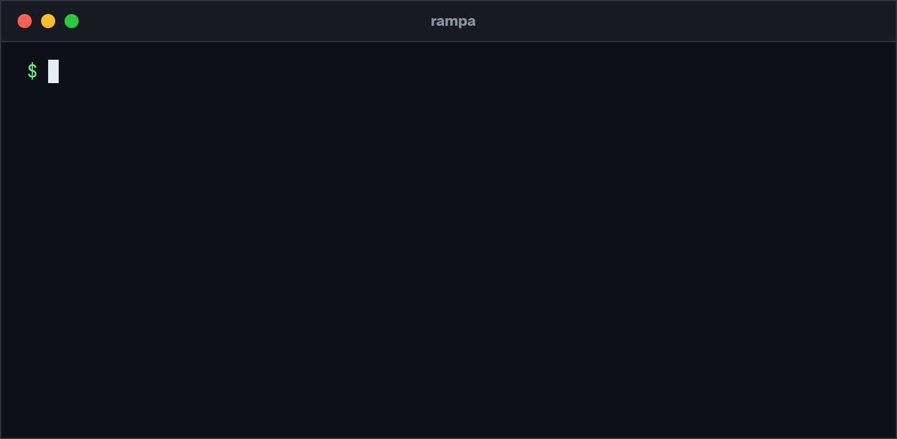
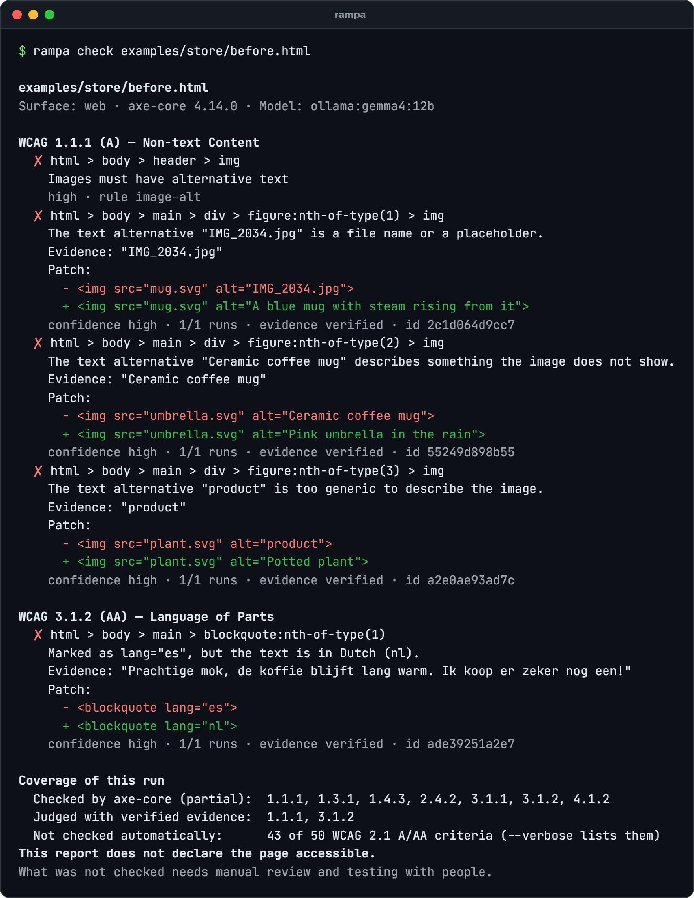
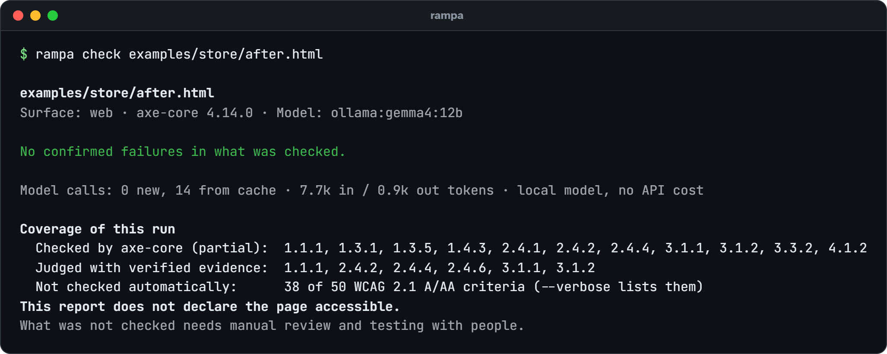
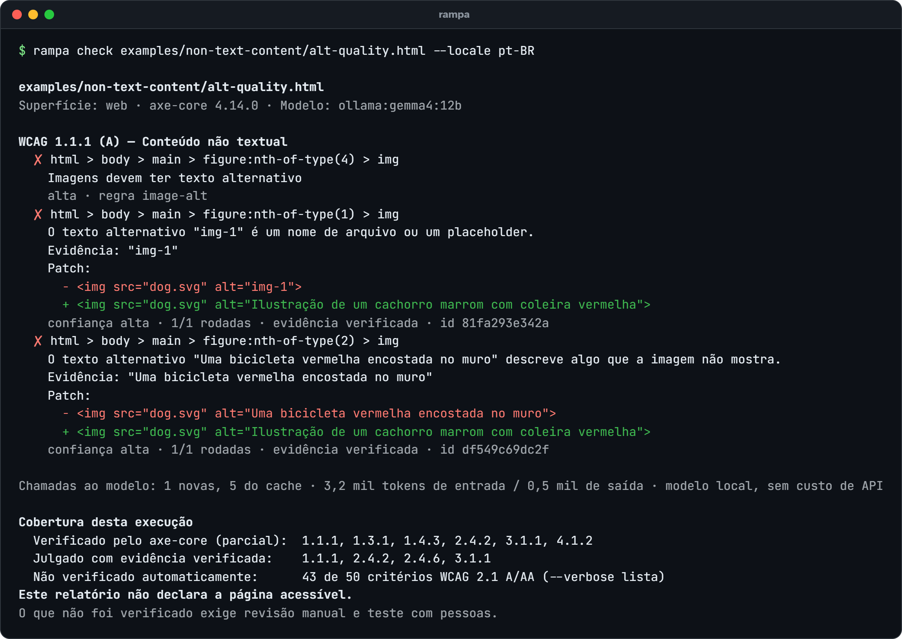
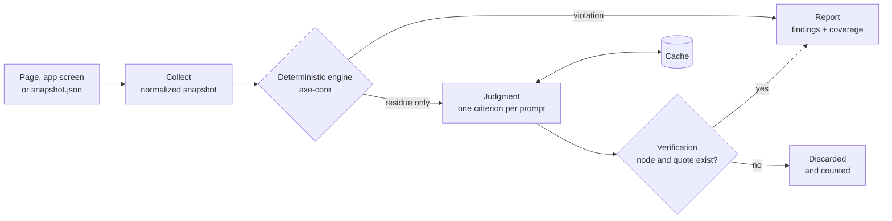
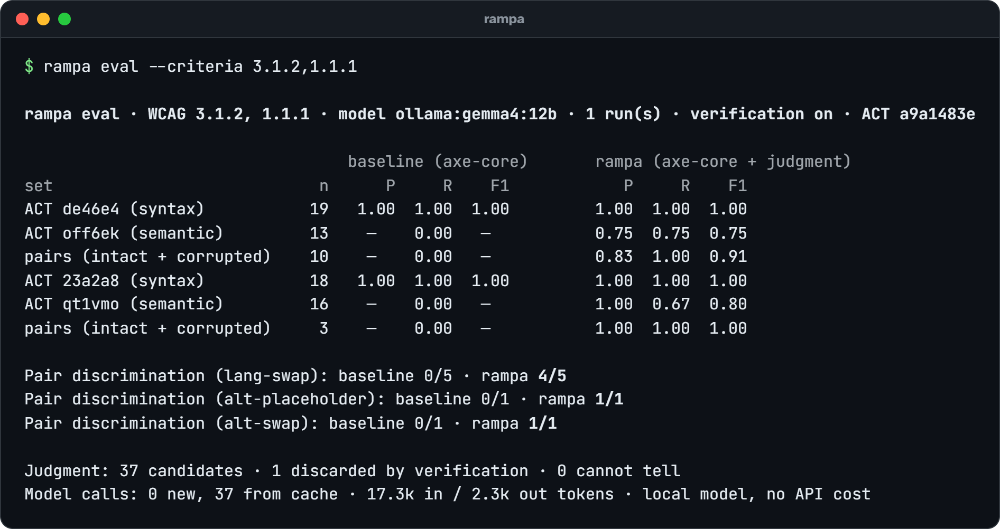

<div align="center">

<picture>
  <source media="(prefers-color-scheme: dark)" srcset="docs/media/banner-dark.png">
  
</picture>

[](https://github.com/guilhermebsantiago/rampa-cli/actions/workflows/ci.yml)
[](LICENSE)


**[Quick start](#quick-start)** · **[Before and after](#before-and-after)** · **[How it works](#how-it-works)** · **[Evaluation](#evaluation)** · **[Roadmap](#roadmap)**

<picture>
  <source media="(prefers-reduced-motion: reduce)" srcset="docs/media/intro.png">
  
</picture>

</div>

## Why

Automated accessibility checkers are good at what attributes and styles can prove. Ask them about meaning and they pass:

```html

```

axe-core reports this image as compliant, because it has an `alt`. A person using a screen reader hears "img-1". The same goes for a link that says "click here", or a Dutch quote marked as Spanish: valid syntax, wrong meaning. In February 2026, 95.9% of the top million home pages had detectable WCAG failures ([WebAIM Million](https://webaim.org/projects/million/)), and that counts only what tools can detect.

Rampa keeps the deterministic engine and adds a judgment layer for that residue:

<table>
<tr>
<td width="33%" valign="top">

**Deterministic first**

axe-core decides everything rules can decide. Its findings go straight to the report, with no model involved.

</td>
<td width="33%" valign="top">

**Judgment on the residue**

A model sees only what the engine could not decide, one WCAG criterion at a time, with the image as it renders when the criterion needs vision.

</td>
<td width="33%" valign="top">

**Evidence or nothing**

Every claim must cite a node and a quote that exist on the page. Claims that do not check out are dropped and counted.

</td>
</tr>
</table>

> [!IMPORTANT]
> Rampa never says a page is accessible. It reports what was checked and what was not. No automated tool replaces a manual audit or testing with disabled people.

*Rampa* is Portuguese for ramp: the structure that turns a staircase into a way in for everyone.

## Before and after

[`examples/store/before.html`](examples/store/before.html) is a small shop page with the kind of problems a deterministic audit lets through. [`after.html`](examples/store/after.html) applies the patches Rampa suggested.

| Image | Before | axe-core | Rampa | After |
| :---: | --- | :---: | --- | --- |
|  | `alt="IMG_2034.jpg"` | passes | file name or placeholder | `alt="Blue ceramic mug"` |
|  | `alt="Ceramic coffee mug"` | passes | describes something the image does not show | `alt="Red rain umbrella"` |
|  | `alt="product"` | passes | too generic | `alt="Potted plant with green leaves"` |
|  | no `alt` | **fails** | reported by axe-core | `alt="Corner Store"` |
|  | `alt="Toto, our store mascot: a smiling cartoon dog with a red collar"` | passes | passes, no false positive | unchanged |
| — | Dutch review marked `lang="es"` | passes | marked Spanish, the text is Dutch | `lang="nl"` |





The patches, as Rampa proposed them:

```diff
- 
+ 
- 
+ 
- 
+ 
- <blockquote lang="es">
+ <blockquote lang="nl">
```

A suggested `alt` is a proposal for a person to review, never a fix applied on its own: what a model says it sees cannot be checked against the page.

<details>
<summary><b>Reports in Portuguese</b> (<code>--locale pt-BR</code>)</summary>
<br>

Suggested alternatives follow the language of the page, and the report follows `--locale`.



</details>

## Quick start

You need Node.js 22.12+, Chrome or Edge (or `npx playwright-core install chromium`), and a model: [Ollama](https://ollama.com) or LM Studio locally, or a key for any major provider (see [Models](#models)).

```sh
git clone https://github.com/guilhermebsantiago/rampa-cli.git
cd rampa-cli
pnpm install
pnpm build

ollama pull gemma4:12b                       # local, free, and it has vision
node dist/cli.mjs doctor                     # checks Node, browser, axe-core, models and keys
node dist/cli.mjs check examples/store/before.html
```

`pnpm link --global` puts `rampa` on your path. Rampa is not on npm yet; once it is, `pnpm dlx rampa check <url>` will be enough.

## Usage

```sh
rampa check https://example.com                     # a live page
rampa check ./dist                                  # every .html file in a folder
rampa check page.html --no-llm                      # the deterministic baseline only
rampa check page.html --criteria 1.1.1              # one criterion
rampa check page.html --runs 3                      # majority vote; agreement sets the confidence
rampa check page.html --format json -o report.json  # for CI and other tools
rampa check page.html --locale pt-BR                # report in Portuguese
rampa check screen.json                             # a snapshot exported by any platform
```

| Command | What it does |
| --- | --- |
| `rampa` | The intro and the list of commands |
| `rampa check <targets...>` | Checks URLs, `.html` files, folders or snapshot `.json` files |
| `rampa eval` | Measures the baseline and the judgment layer on W3C ACT test cases and corrupted pairs |
| `rampa models` | Recommended models per criterion, and which are ready on this machine |
| `rampa doctor` | Checks the environment |

Exit codes: `0` no confirmed failure, `1` at least one confirmed failure, `2` execution or configuration error.

<details>
<summary><b>All <code>check</code> options</b></summary>
<br>

| Option | Default | Effect |
| --- | --- | --- |
| `-c, --criteria <ids>` | `1.1.1,3.1.2` | Criteria to judge |
| `-m, --model <provider:model>` | detected | Model for the judgment layer |
| `--no-llm` | | Deterministic layer only |
| `-r, --runs <k>` | `1` | Judgments per candidate, majority vote |
| `--reasoning <level>` | `none` locally | `provider-default`, `none`, `minimal`, `low`, `medium`, `high` |
| `-f, --format <format>` | `pretty` | `pretty` or `json` |
| `-o, --output <file>` | | Also write the JSON report to a file |
| `--fail-on <policy>` | `confirmed` | `confirmed`, `any` or `never` |
| `--min-confidence <level>` | `medium` | Hide findings below `low`, `medium` or `high` |
| `--offline` | | Cached judgments only, never call the model |
| `--screenshots` | | Save full-page screenshots to `.rampa/screenshots` |
| `--cache-dir <dir>` | `.rampa/cache` | Judgment cache |
| `--concurrency <n>` | `4` | Parallel model calls |
| `--locale <locale>` | `en` | `en` or `pt-BR` |
| `--verbose` | | List discarded claims, low-confidence findings and unchecked criteria |

</details>

<details>
<summary><b>Configuration file</b></summary>
<br>

`rampa.config.mjs` or `rampa.config.json` in the working directory (`rampa.config.ts` works on Node 22.18+). Command-line options win over the file.

```js
export default {
  model: 'ollama:gemma4:12b',
  criteria: ['1.1.1', '3.1.2'],
  runs: 1,
  locale: 'en',
  minConfidence: 'medium',
}
```

API keys never go in this file: use environment variables or a local `.env`.

</details>

## Models

The judgment runs on a local model or on any major provider, through the [AI SDK](https://ai-sdk.dev). Pass `--model provider:model`, set `RAMPA_MODEL` or `model` in the config, or let Rampa choose: a local Ollama model first, then the first provider in this table with credentials. `rampa models` shows what is ready on your machine, and `rampa doctor` says what is missing. Keys go in the environment or in a `.env` file in the working directory, never in the config file.

| Provider | Recommended model | USD per 1M tokens, in / out | Credentials |
| --- | --- | --- | --- |
| Ollama (local) | `ollama:gemma4:12b` | free | none; `OLLAMA_BASE_URL` if not on localhost |
| LM Studio (local) | `lmstudio:<loaded model>` | free | none; `LMSTUDIO_BASE_URL` if not on localhost:1234 |
| Anthropic | `anthropic:claude-haiku-5-5` | 0.10 / 0.50 | `ANTHROPIC_API_KEY` |
| OpenAI | `openai:gpt-6-luna` | 0.10 / 0.50 | `OPENAI_API_KEY` |
| Google Gemini API | `google:gemini-3.5-flash-lite` | 0.30 / 2.50, free tier | `GEMINI_API_KEY` (or `GOOGLE_GENERATIVE_AI_API_KEY`) |
| Vercel AI Gateway | `gateway:openai/gpt-6-luna` | the provider's price | `AI_GATEWAY_API_KEY` |
| OpenRouter | `openrouter:openai/gpt-6-luna` | the provider's price | `OPENROUTER_API_KEY` |
| Amazon Bedrock | `bedrock:global.anthropic.claude-haiku-5-5` | 0.10 / 0.50 | `AWS_REGION` and `AWS_BEARER_TOKEN_BEDROCK` (or `AWS_ACCESS_KEY_ID` + `AWS_SECRET_ACCESS_KEY`) |
| Google Vertex AI | `vertex:gemini-3.5-flash-lite` | 0.30 / 2.50 | `GOOGLE_VERTEX_PROJECT` with Application Default Credentials (or `GOOGLE_VERTEX_API_KEY`) |
| Mistral AI | `mistral:mistral-small-latest` | 0.15 / 0.60 | `MISTRAL_API_KEY` |
| Together AI | `togetherai:Qwen/Qwen3.5-9B` | 0.17 / 0.25 | `TOGETHER_API_KEY` |
| Fireworks AI | `fireworks:accounts/fireworks/models/glm-5p3-flash` | 0.15 / 0.50 | `FIREWORKS_API_KEY` |
| DeepSeek | `deepseek:deepseek-flash` | 0.30 / 1.20, half off-peak | `DEEPSEEK_API_KEY` |
| xAI | `xai:grok-4.20-0309-non-reasoning` | 1.25 / 2.50 | `XAI_API_KEY` |
| Cerebras | `cerebras:qwen-3.8-27b` | 0.99 / 1.49 | `CEREBRAS_API_KEY` |
| Groq | `groq:qwen/qwen3.8-27b` (preview) | 0.80 / 4.00 | `GROQ_API_KEY` |
| Azure OpenAI | `azure:<deployment>`, for example of gpt-6-luna | 0.10 / 0.50 | `AZURE_API_KEY` and `AZURE_RESOURCE_NAME` (or `AZURE_BASE_URL`) |
| Claude on Vertex AI | `vertex-anthropic:<model id as Vertex lists it>` | Vertex's price | `GOOGLE_VERTEX_PROJECT` with Application Default Credentials |
| Any OpenAI-compatible server (vLLM, llama.cpp…) | `openai-compatible:<model>` | | `RAMPA_OPENAI_COMPATIBLE_URL`, optional `RAMPA_OPENAI_COMPATIBLE_KEY` |

Model ids and prices were checked on each provider's own pages on 2026-10-07, and every recommended model takes images. LM Studio and the last three need a name only you know, so Rampa never picks them on its own. Short aliases work too: `gemini:`, `aws:`, `together:`, `vercel:`.

- **Every provider has a test.** It checks the request the provider builds (prompt, image and schema) and reads a reply in its wire format, with no network. The published evaluation ran on Ollama; tables for hosted models come next.
- **Cloud details.** Vertex uses the `global` location unless `GOOGLE_VERTEX_LOCATION` says otherwise. Bedrock returns the JSON through a forced tool, which every Claude on Bedrock supports; with AWS SSO or profiles, export the session first with `eval "$(aws configure export-credentials --format env)"`. Azure takes your deployment name, not the model name.
- **1.1.1 needs vision.** `gemma4:12b` has it and runs on a 16 GB GPU; for text-only models such as `groq:openai/gpt-oss-20b`, judge 3.1.2 alone with `--criteria 3.1.2`.
- **Reasoning is off by default for local models.** On an RTX 5060 Ti that cut a judgment from about 6 s to 2 s with the same answer; `--reasoning` brings it back, and `rampa eval` can measure the trade-off.
- **Subscriptions.** Anthropic does not allow third-party tools to offer claude.ai login or subscription limits unless approved ([Agent SDK docs](https://code.claude.com/docs/en/agent-sdk/overview)), so Rampa uses API keys. Claude Max and Team plans include monthly API credits ([Help Center](https://support.claude.com/en/articles/15036540)), which an API key can draw on.
- **Recommendations come from measurement.** `rampa models` lists a starting point; the model per criterion should be chosen with `rampa eval`, not generic benchmarks.

## How it works

1. **Collect.** The target becomes a normalized accessibility snapshot: the accessibility tree with ARIA roles, names, languages, states and bounds, plus each image as rendered and the source markup.
2. **Deterministic engine.** axe-core runs on the page, and its violations go straight to the report.
3. **Judgment.** Only the residue goes to the model: what the engine reported as incomplete, passed on syntax alone, or does not check at all. One prompt per criterion, minimal context, structured JSON output.
4. **Verification.** The cited node must exist and the quoted text must be in it, or the claim is dropped and counted.
5. **Report.** Findings by criterion, a patch when possible, and the coverage of the run: what the engine checked, what was judged, and what nobody checked.



Judgments are cached by a hash of prompt, image, model and settings, so the same input never calls the model twice. `--runs k` asks k times and keeps the majority; when runs disagree, confidence drops.

### Any screen, not only the web

Criteria never read the DOM. They read the snapshot, so the core is the same for any platform. `rampa check screen.json` accepts a snapshot from any exporter that follows [`schema/snapshot.schema.json`](schema/snapshot.schema.json): an Android view hierarchy, an iOS XCUITest export, a desktop UI Automation tree. The same 1.1.1 module judges an `alt`, a `contentDescription` or an `accessibilityLabel`. Android, iOS and image-only collectors are on the roadmap.

## Evaluation

`rampa eval` measures, on the same pages, axe-core alone and axe-core with the judgment layer:



| Set | Cases | axe-core P / R | Rampa P / R / F1, both models |
| --- | :---: | :---: | :---: |
| 3.1.2, ACT de46e4 (valid tag, syntax) | 19 | 1.00 / 1.00 | 1.00 / 1.00 / 1.00 |
| 3.1.2, ACT off6ek (language matches the text) | 13 | — / 0.00 | 0.75 / 0.75 / 0.75 |
| 3.1.2, corrupted pairs (`lang` swapped) | 10 | — / 0.00 | 0.83 / 1.00 / 0.91 |
| 1.1.1, ACT 23a2a8 (has a name, syntax) | 18 | 1.00 / 1.00 | 1.00 / 1.00 / 1.00 |
| 1.1.1, ACT qt1vmo (name is descriptive) | 16 | — / 0.00 | 1.00 / 0.67 / 0.80 |

First run on 2026-10-07: axe-core 4.14.0, Gemma 4 12B on a local GPU, reasoning off, one run, ACT test cases `a9a1483e`. A second run from an empty cache gave the same numbers. The judgment layer added no false positive on the syntax sets, and no claim failed verification in this run; the unit tests show what happens to one that does. The samples are small; read these numbers as a working pipeline, not as a result. Wilson intervals are in each run's `summary.json`.

On 2026-10-08, `openai:gpt-6-luna` (reasoning at its default, medium) got the same numbers, in two runs with fresh calls that gave the same verdict on all 73 cases: 36 judgments, 29 s, about US$ 0.005 per run. The errors are not the same. The two failures that both runs miss never reached a model: Rampa does not yet treat `<canvas>` as an image for 1.1.1 (qt1vmo, Failed Example 3), and for 3.1.2 it reads an image's `alt` but not a name that comes from `aria-labelledby` (off6ek, Failed Example 4). Both gaps are on the roadmap. The model errors are two false positives on the same sentence, "Paul put dire comment on tape", which is English and French at once: Gemma reads it as English where it is marked French, gpt-6-luna as French where it is marked English. Requiring both models to agree would remove both, but they come from one sentence built to be ambiguous, so that is a hypothesis to test, not a result.

```sh
rampa eval --criteria 1.1.1,3.1.2 --no-llm      # baseline only
rampa eval --criteria 1.1.1,3.1.2               # baseline vs judgment
rampa eval --criteria 1.1.1,3.1.2 --no-verify   # ablation: what verification is worth
rampa eval --criteria 3.1.2 --runs 5            # variance between runs
```

The [W3C ACT test cases](https://www.w3.org/WAI/standards-guidelines/act/rules/) are downloaded at run time and their SHA-256 is recorded with every run. Corrupted pairs follow [López-Gil & Pereira (2025)](https://doi.org/10.1007/s10209-024-01108-z): break a passing case on purpose (`alt` becomes `img-1`, `lang` becomes another valid language) and check that the verdict flips. A tool that gives both versions the same verdict is not judging.

## Principles

- **Never say "accessible."** Every report lists what was checked, what was judged, and what nobody checked.
- **Verification is mandatory.** A model claim without evidence that checks out never reaches a person.
- **False positives are a constraint, not a metric.** Noise is what makes teams switch a tool off; confidence thresholds and waivers are part of the design.
- **Reproducible.** Model, prompt version and date are recorded; the same input gives the same verdict from the cache.
- **Not an overlay.** Rampa runs in development and CI, never in production pages.
- **Private by choice.** With Ollama or LM Studio, nothing leaves your machine. There is no telemetry.
- **No lock-in.** The same judgment runs on a local model or on any major provider, and `rampa eval` measures which model to trust for each criterion.

## Roadmap

- [x] Web surface: Playwright and axe-core over a normalized snapshot
- [x] WCAG 1.1.1 with vision, with a suggested `alt` as the patch
- [x] WCAG 3.1.2, language of parts
- [x] `rampa eval` with ACT test cases, corrupted pairs and the verification ablation
- [x] Local models and the major providers: OpenAI, Anthropic, Google, Azure, Bedrock, Vertex, Mistral, xAI, Groq, DeepSeek, Together, Fireworks, Cerebras, OpenRouter, Vercel AI Gateway
- [ ] The evaluation table for each provider's recommended model
- [ ] Publish on npm: `pnpm dlx rampa`
- [ ] MCP server, so coding agents can call `rampa check`
- [ ] Rampa Lab, a web app to explore evaluation runs
- [ ] Close the two gaps the error analysis found: `<canvas>` as an image for 1.1.1, and image names from `aria-labelledby` as text for 3.1.2
- [ ] WCAG 2.4.4, link purpose with the destination page
- [ ] SARIF and Markdown output, a GitHub Action that comments on pull requests
- [ ] Android (adb and UI Automator), iOS (XCUITest export) and image-only surfaces
- [ ] A false-positive study on real pages

## Development

```sh
pnpm typecheck
pnpm test        # unit tests; the browser tests run when Chrome or Edge is available
pnpm build       # dist/ and schema/
pnpm media       # re-renders every image in this README from the real CLI
```

During development, `node src/cli.ts` runs the TypeScript sources directly. [`demo/`](demo/) has a guided walkthrough and a Fedora setup script; with `MODO=offline` it replays recorded snapshots and judgments, with no browser and no model. Issues and pull requests are welcome; start with [CONTRIBUTING.md](CONTRIBUTING.md). To report a vulnerability, see [SECURITY.md](SECURITY.md).

<details>
<summary><b>Em português</b></summary>
<br>

O Rampa verifica acessibilidade além da sintaxe. Ele roda o axe-core e manda só o resíduo que o axe não sabe decidir para um modelo, um critério WCAG por vez, e descarta toda alegação sem evidência conferível na página. No exemplo clássico, `alt="img-1"` numa foto de cachorro passa no axe-core porque o atributo existe; o Rampa olha a imagem, aponta o placeholder e sugere um texto alternativo no idioma da página.

Use `--locale pt-BR` para o relatório em português. O julgamento roda num modelo local (Ollama ou LM Studio) ou nos grandes provedores, como OpenAI, Anthropic, Google, Azure, Bedrock, Vertex e Mistral; `rampa models` mostra o que está pronto na sua máquina. O Rampa nunca declara uma página acessível e não substitui auditoria manual nem teste com pessoas com deficiência.

</details>

## License

[MIT](LICENSE). Third-party material:

- [axe-core](https://github.com/dequelabs/axe-core) (MPL-2.0) is a dependency, loaded unmodified from `node_modules`.
- The prompts quote short normative passages of [WCAG 2.1](https://www.w3.org/TR/WCAG21/), Copyright © W3C, used under the [W3C Document License](https://www.w3.org/copyright/document-license/).
- The [W3C ACT test cases](https://act-rules.github.io/pages/license/) are downloaded at run time and never redistributed.
- The illustrations in `examples/` were drawn for this project and are covered by its MIT license.
