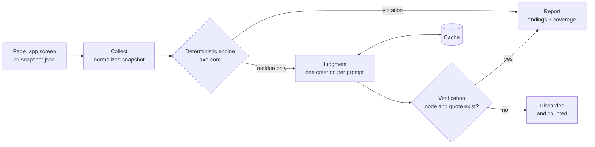

<div align="center">

<picture>
  <source media="(prefers-color-scheme: dark)" srcset="docs/media/banner-dark.png">
  
</picture>

[](https://github.com/guilhermebsantiago/rampa-cli/actions/workflows/ci.yml)
[](LICENSE)


**[Quick start](#quick-start)** · **[Before and after](#before-and-after)** · **[How it works](#how-it-works)** · **[Evaluation](#evaluation)** · **[Roadmap](#roadmap)**

<picture>
  <source media="(prefers-reduced-motion: reduce)" srcset="docs/media/intro.png">
  
</picture>

</div>

**Rampa is an open-source WCAG accessibility checker for the command line.** It runs [axe-core](https://github.com/dequelabs/axe-core), then asks a language model, one WCAG 2.2 success criterion at a time, about what rules cannot decide: whether an image's alt text describes it, a page title names the page, a link says where it goes and matches where it leads, a heading or label describes its content, a form field identifies what it collects, a field's label is visible, and the language attributes match the text. A finding is kept only when the element it cites exists and the text it quotes is in it. It runs on a local model through Ollama or on any major provider, it is measured against the W3C ACT test cases, and it works where you do: in a terminal, in CI with SARIF and pull request comments, inside Playwright tests, and for coding agents over MCP. Site: [rampa.guilhermebs.com.br](https://rampa.guilhermebs.com.br) ([em português](https://rampa.guilhermebs.com.br/pt/)).

## Why

Automated accessibility checkers are good at what attributes and styles can prove. Ask them about meaning and they pass:

```html

```

axe-core reports this image as compliant, because it has an `alt`. A person using a screen reader hears "img-1". The same goes for a page titled "Untitled document", a link that says "Click here", a heading "Section 2" over customer reviews, a field labeled "Field 1", or a Dutch quote marked as Spanish: valid syntax, wrong meaning. In February 2026, 95.9% of the top million home pages had detectable WCAG failures ([WebAIM Million](https://webaim.org/projects/million/)), and that counts only what tools can detect.

Rampa keeps the deterministic engine and adds a judgment layer for that residue:

<table>
<tr>
<td width="33%" valign="top">

**Deterministic first**

axe-core decides everything rules can decide. Its findings go straight to the report, with no model involved.

</td>
<td width="33%" valign="top">

**Judgment on the residue**

A model sees only what the engine could not decide, one WCAG criterion at a time, with the image as it renders when the criterion needs vision.

</td>
<td width="33%" valign="top">

**Evidence or nothing**

Every claim must cite a node and a quote that exist on the page. Claims that do not check out are dropped and counted.

</td>
</tr>
</table>

> [!IMPORTANT]
> Rampa never says a page is accessible. It reports what was checked and what was not. No automated tool replaces a manual audit or testing with disabled people.

*Rampa* is Portuguese for ramp: the structure that turns a staircase into a way in for everyone.

## What it judges

Nine WCAG success criteria have a judgment module; eight run by default, and 1.4.5 runs when you ask for it. For each, axe-core keeps the part rules can decide, and the model only sees the rest. [docs/criteria.md](docs/criteria.md) describes each module: its context, verification and limits.

> [!NOTE]
> On real pages, judgments about ordinary titles, links, headings and labels were mostly false positives in the [first real-page study](docs/studies/real-pages-2026-10.md): with Gemma 4 12B, precision was 0 of 55 on 2.4.4 and 0 of 45 on 2.4.6, while the W3C test cases scored much higher. So for 2.4.2, 2.4.4 and 2.4.6, a finding keeps its confidence only when the text is generic by a fixed list ("Click here", "Section 2", "Untitled document", "Field 1"); any other is reported at low confidence, below the default threshold: `--verbose` lists it, it never fails a build, and `rampa eval` still scores it.

| Criterion | axe-core checks | Rampa judges | Example it catches |
| --- | --- | --- | --- |
| 1.1.1 Non-text Content | an image has an alternative | the alternative serves the same purpose, seen against the image as rendered | `alt="img-1"` on a photo of a dog |
| 1.3.5 Identify Input Purpose | `autocomplete` values are valid | a field that collects the user's own data names its purpose with the right token | an email field with no `autocomplete` |
| 1.4.5 Images of Text (on request) | nothing | an image whose content is text that could be real text, logos excepted | a banner that is a picture of a sentence |
| 2.4.2 Page Titled | the page has a title | the title describes the page | `<title>Untitled document</title>` |
| 2.4.4 Link Purpose | a link has a name | the name, with its context and the page it really leads to, tells where the link goes ([details](docs/link-purpose.md)) | a lone "Click here"; "Pricing" that opens a blog post |
| 2.4.6 Headings and Labels | headings are not empty, fields have a label | a heading describes the content under it; a label says what to enter | "Section 2" over reviews, "Field 1" on an email field |
| 3.1.1 Language of Page | `lang` is present and valid | `lang` is the language most of the page is written in | `lang="en"` on a page in Portuguese |
| 3.1.2 Language of Parts | `lang` values are valid | each passage is in the language it declares | a Dutch review marked `lang="es"` |
| 3.3.2 Labels or Instructions | a field has a name | the name is visible on screen, and an enforced pattern is explained | a field named only by `aria-label` |

Every finding cites the element and its current text, and verification drops any claim whose quote is not on the page. Each module has W3C ACT test cases to measure it against (see [Evaluation](#evaluation)).

### Beyond judgment

Rampa reports against WCAG 2.2 by default (`--wcag 2.1` for the older target), and every report gives each of the 55 A/AA criteria a status: failures, needs review, no failure found, no applicable content, or not checked. Never "passed". Around the judged criteria:

| What | Checks | Guide |
| --- | --- | --- |
| Rampa rules (experimental) | Deterministic checks axe-core does not make: placeholder alt text, framework default titles, viewport zoom, the HTTP Refresh header, language switchers, table headers, layout tables, labels that name nothing, ids that hijack a name, a field's label left out of its name (2.5.3), labels that show nothing on screen, error messages on the page that are not in text or give no suggestion (3.3.1, 3.3.3), contrast measured from pixels where axe-core cannot decide (1.4.3, 1.4.11), and checks over the browser's own accessibility tree: controls with no name or no role, tab and disclosure states (4.1.2), live regions listed for 4.1.3 | [docs/rules.md](docs/rules.md) |
| WCAG 2.2 | 2.5.8 Target Size (experimental), the 2.2 list and honest coverage: axe-core's "incomplete" results become items to review, never "checked" | [docs/wcag-2-2.md](docs/wcag-2-2.md) |
| Probes (experimental, `--probe layout|keyboard|hover|orientation|shortcuts|media|all`) | Drive the page read-only: captions, audio description and sound that plays by itself (1.2.1–1.2.5, 1.4.2), orientation locked (1.3.4), text cut at 200% zoom (1.4.4), reflow at 320 CSS px (1.4.10), text spacing (1.4.12), content on hover or focus (1.4.13), keyboard reachability and traps (2.1.1, 2.1.2), single-key shortcuts (2.1.4), change on focus (3.2.1), focus visible and not obscured (2.4.7, 2.4.11) | [docs/probes.md](docs/probes.md) |
| Site criteria (experimental) | With `--crawl` or `--sitemap`: 3.2.3 Consistent Navigation and 3.2.6 Consistent Help, across the pages of a template | [docs/site-criteria.md](docs/site-criteria.md) |
| Cognitive profile | `--profile cognitive`: advisories from the W3C COGA guidance (input formats that reject how people write, labels that are only a placeholder, pre-ticked paid options, unexplained abbreviations) plus readability measurements. Advisories are never WCAG failures and never change the exit code unless you ask | [docs/cognitive-profile.md](docs/cognitive-profile.md) |

Experimental checks report at low confidence, below the default threshold, until enough of their findings have been reviewed by a person; `--verbose` or `--min-confidence low` shows them. The plans behind this are in [docs/plans](docs/plans).

## Before and after

[`examples/store/before.html`](examples/store/before.html) is a small shop page with the kind of problems a deterministic audit lets through. [`after.html`](examples/store/after.html) applies the patches Rampa suggested.

| Image | Before | axe-core | Rampa | After |
| :---: | --- | :---: | --- | --- |
|  | `alt="IMG_2034.jpg"` | passes | file name or placeholder | `alt="Blue ceramic mug"` |
|  | `alt="Ceramic coffee mug"` | passes | describes something the image does not show | `alt="Red rain umbrella"` |
|  | `alt="product"` | passes | too generic | `alt="Potted plant with green leaves"` |
|  | no `alt` | **fails** | reported by axe-core | `alt="Corner Store"` |
|  | `alt="Toto, our store mascot: a smiling cartoon dog with a red collar"` | passes | passes, no false positive | unchanged |
| — | Dutch review marked `lang="es"` | passes | marked Spanish, the text is Dutch | `lang="nl"` |
| — | `<title>Untitled document</title>` | passes | says nothing about the page | `New arrivals \| Corner Store` |
| — | a lone link "Click here" | passes | does not tell where it goes | "Shipping and returns" |
| — | heading "Section 2" over the reviews | passes | says nothing about the content | "What customers say" |
| — | email field labeled "Field 1" | passes | does not say what to enter | "Email address" |
| — | the same field without `autocomplete` | passes | does not identify what it collects | `autocomplete="email"` |


The patches, as Rampa proposed them:

```diff
- 
+ 
- 
+ 
- 
+ 
- <blockquote lang="es">
+ <blockquote lang="nl">
```

A suggested `alt` is a proposal for a person to review, never a fix applied on its own: what a model says it sees cannot be checked against the page.

<details>
<summary><b>Reports in Portuguese</b> (<code>--locale pt-BR</code>)</summary>
<br>

Suggested alternatives follow the language of the page, and the report follows `--locale`.


</details>

## Quick start

You need Node.js 22.12+, Chrome or Edge (or `npx playwright-core install chromium`), and a model: [Ollama](https://ollama.com) or LM Studio locally, or a key for any major provider (see [Models](#models)).

```sh
git clone https://github.com/guilhermebsantiago/rampa-cli.git
cd rampa-cli
pnpm install
pnpm build

ollama pull gemma4:12b                       # local, free, and it has vision
node dist/cli.mjs doctor                     # checks Node, browser, axe-core, models and keys
node dist/cli.mjs check examples/store/before.html
```

`pnpm link --global` puts `rampa` on your path. Rampa is not on npm yet; once it is, `pnpm dlx rampa check <url>` will be enough.

## Usage

```sh
rampa check https://example.com                     # a live page
rampa check ./dist                                  # every .html file in a folder
rampa check page.html --no-llm                      # the deterministic baseline only
rampa check page.html --criteria 1.1.1              # one criterion
rampa check page.html --runs 3                      # majority vote; agreement sets the confidence
rampa check page.html --format json -o report.json  # for CI and other tools
rampa check page.html --sarif r.sarif --markdown r.md --html r.html   # more reports from one run
rampa check page.html --fail-on AA                  # exit 1 only for Level A and AA findings
rampa check https://example.com --crawl --max-pages 20                # a whole site, shared components once
rampa check https://example.com --device "iPhone 15" --color-scheme dark
rampa check page.html --locale pt-BR                # report in Portuguese
rampa check page.html --wcag 2.1                    # report against WCAG 2.1 instead of 2.2
rampa check page.html --profile cognitive           # add the cognitive accessibility advisories
rampa check screen.json                             # a snapshot exported by any platform
rampa check android:                                # the screen on a connected Android device
```

| Command | What it does |
| --- | --- |
| `rampa` | The intro and the list of commands |
| `rampa check <targets...>` | Checks URLs, `.html` files, folders, snapshots, Android screens, XCUITest exports or PNG screenshots |
| `rampa init` | Sets Rampa up in a project: config, waivers, `.gitignore` and, with `--github`, a CI workflow |
| `rampa baseline` | Records today's findings, so `rampa check --baseline` reports only new ones |
| `rampa waive <id>` / `rampa waivers` | Accepts a finding with a reason and an expiry date; lists expired and unused waivers |
| `rampa eval` | Measures the baseline and the judgment layer on W3C ACT test cases and corrupted pairs |
| `rampa compare <runs...>` | Compares eval runs per criterion, with intervals and a paired test |
| `rampa mcp` | Serves Rampa to coding agents over the Model Context Protocol |
| `rampa models` | Recommended models per criterion, and which are ready on this machine |
| `rampa doctor` | Checks the environment |

Exit codes: `0` no confirmed failure, `1` at least one confirmed failure (see `--fail-on`), `2` execution, configuration or usage error.

<details>
<summary><b>All <code>check</code> options</b></summary>
<br>

| Option | Default | Effect |
| --- | --- | --- |
| `-c, --criteria <ids>` | eight | Criteria to judge: `1.1.1`, `1.3.5`, `2.4.2`, `2.4.4`, `2.4.6`, `3.1.1`, `3.1.2`, `3.3.2`, and `1.4.5` on request |
| `-m, --model <provider:model>` | detected | Model for the judgment layer |
| `--no-llm` | | Deterministic layer only |
| `-r, --runs <k>` | `1` | Judgments per candidate, majority vote |
| `--reasoning <level>` | `none` locally | `provider-default`, `none`, `minimal`, `low`, `medium`, `high` |
| `-f, --format <format>` | `pretty` | `pretty`, `json`, `sarif`, `markdown` or `html` ([formats](docs/output-formats.md)) |
| `-o, --output <file>` | | Write the report to a file; with `pretty`, the file gets JSON |
| `--json`, `--sarif`, `--markdown`, `--html <file>` | | Also write that format from the same run |
| `--fail-on <policy>` | `confirmed` | `confirmed`, `any`, `A`, `AA` or `none` |
| `--baseline <file>` | | Report only findings the baseline does not have ([adoption](docs/adoption.md)) |
| `--follow-links <policy>` | `same-origin` | Read where links lead for 2.4.4: `none`, `same-origin` or `all` |
| `--save <dir>` | | Record each snapshot and its engine results, to check later without a browser |
| `--crawl`, `--sitemap`, `--max-pages` | | Check a whole site ([crawl](docs/crawl.md)) |
| `--storage-state`, `--header`, `--device`, `--viewport`, `--color-scheme`, `--wait-for` | | Pages behind a login, phones, dark mode ([browser options](docs/browser-options.md)) |
| `--min-confidence <level>` | `medium` | Hide findings below `low`, `medium` or `high` |
| `--offline` | | Cached judgments only, never call the model |
| `--screenshots` | | Save full-page screenshots to `.rampa/screenshots` |
| `--cache-dir <dir>` | `.rampa/cache` | Judgment cache |
| `--concurrency <n>` | `4` | Parallel model calls |
| `--locale <locale>` | `en` | `en` or `pt-BR` |
| `--verbose` | | List discarded claims, low-confidence findings and unchecked criteria |

</details>

<details>
<summary><b>Configuration file</b></summary>
<br>

`rampa.config.mjs` or `rampa.config.json` in the working directory (`rampa.config.ts` works on Node 22.18+). Command-line options win over the file.

```js
export default {
  model: 'ollama:gemma4:12b',
  criteria: ['1.1.1', '1.3.5', '2.4.2', '2.4.4', '2.4.6', '3.1.1', '3.1.2', '3.3.2'],
  runs: 1,
  locale: 'en',
  minConfidence: 'medium',
}
```

API keys never go in this file: use environment variables or a local `.env`. `rampa init` writes a starting config for you.

</details>

## Use it where you work

| Where | How | Guide |
| --- | --- | --- |
| GitHub Actions | `uses: guilhermebsantiago/rampa-cli@main`: SARIF to code scanning and one sticky pull request comment, with each finding's patch | [docs/github-action.md](docs/github-action.md) |
| Reports | SARIF, Markdown for pull requests, a single-file HTML report, JSON; `file:line` for local pages | [docs/output-formats.md](docs/output-formats.md) |
| Pre-commit | the pre-commit framework, Husky, lint-staged or Lefthook, on staged `.html` files | [docs/pre-commit.md](docs/pre-commit.md) |
| Playwright tests | `import { checkPage } from 'rampa/playwright'` and `await expect(page).toPassRampa()`, scoped to a component if you like | [docs/playwright.md](docs/playwright.md) |
| Storybook | the test runner's `postVisit` hook, one story at a time | [docs/storybook.md](docs/storybook.md) |
| Your own code | `import { check } from 'rampa'` | [docs/api.md](docs/api.md) |
| Coding agents | `rampa mcp` for Claude Code, Cursor, VS Code and others: check, fix, check again | [docs/mcp.md](docs/mcp.md) |
| Whole sites | `--crawl` or `--sitemap`, robots.txt respected, a shared header reported once | [docs/crawl.md](docs/crawl.md) |
| Existing codebases | `rampa init`, a baseline so CI fails only on new findings, waivers with reasons and expiry | [docs/adoption.md](docs/adoption.md) |
| Android and iOS | `rampa check android:` over adb; XCUITest exports from a Swift helper | [docs/android.md](docs/android.md), [docs/ios.md](docs/ios.md) |
| Screenshots | `rampa check screen.png`: text contrast measured from pixels, nothing it cannot see | [docs/image-surface.md](docs/image-surface.md) |
| Choosing a model | `rampa eval` per criterion, then `rampa compare` | [docs/models.md](docs/models.md) |
| Exploring an evaluation | load a run folder in [Rampa Lab](https://guilhermebsantiago.github.io/rampa-lab/): scores, case by case, two runs compared; files stay in your browser | |

## Models

The judgment runs on a local model or on any major provider, through the [AI SDK](https://ai-sdk.dev). Pass `--model provider:model`, set `RAMPA_MODEL` or `model` in the config, or let Rampa choose: a local Ollama model first, then the first provider in this table with credentials. `rampa models` shows what is ready on your machine, and `rampa doctor` says what is missing. Keys go in the environment or in a `.env` file in the working directory, never in the config file.

| Provider | Recommended model | USD per 1M tokens, in / out | Credentials |
| --- | --- | --- | --- |
| Ollama (local) | `ollama:gemma4:12b` | free | none; `OLLAMA_BASE_URL` if not on localhost |
| LM Studio (local) | `lmstudio:<loaded model>` | free | none; `LMSTUDIO_BASE_URL` if not on localhost:1234 |
| Anthropic | `anthropic:claude-haiku-5-5` | 0.10 / 0.50 | `ANTHROPIC_API_KEY` |
| OpenAI | `openai:gpt-6-luna` | 0.10 / 0.50 | `OPENAI_API_KEY` |
| Google Gemini API | `google:gemini-3.5-flash-lite` | 0.30 / 2.50, free tier | `GEMINI_API_KEY` (or `GOOGLE_GENERATIVE_AI_API_KEY`) |
| Vercel AI Gateway | `gateway:openai/gpt-6-luna` | the provider's price | `AI_GATEWAY_API_KEY` |
| OpenRouter | `openrouter:openai/gpt-6-luna` | the provider's price | `OPENROUTER_API_KEY` |
| Amazon Bedrock | `bedrock:global.anthropic.claude-haiku-5-5` | 0.10 / 0.50 | `AWS_REGION` and `AWS_BEARER_TOKEN_BEDROCK` (or `AWS_ACCESS_KEY_ID` + `AWS_SECRET_ACCESS_KEY`) |
| Google Vertex AI | `vertex:gemini-3.5-flash-lite` | 0.30 / 2.50 | `GOOGLE_VERTEX_PROJECT` with Application Default Credentials (or `GOOGLE_VERTEX_API_KEY`) |
| Mistral AI | `mistral:mistral-small-latest` | 0.15 / 0.60 | `MISTRAL_API_KEY` |
| Together AI | `togetherai:Qwen/Qwen3.5-9B` | 0.17 / 0.25 | `TOGETHER_API_KEY` |
| Fireworks AI | `fireworks:accounts/fireworks/models/glm-5p3-flash` | 0.15 / 0.50 | `FIREWORKS_API_KEY` |
| DeepSeek | `deepseek:deepseek-flash` | 0.30 / 1.20, half off-peak | `DEEPSEEK_API_KEY` |
| xAI | `xai:grok-4.20-0309-non-reasoning` | 1.25 / 2.50 | `XAI_API_KEY` |
| Cerebras | `cerebras:qwen-3.8-27b` | 0.99 / 1.49 | `CEREBRAS_API_KEY` |
| Groq | `groq:qwen/qwen3.8-27b` (preview) | 0.80 / 4.00 | `GROQ_API_KEY` |
| Azure OpenAI | `azure:<deployment>`, for example of gpt-6-luna | 0.10 / 0.50 | `AZURE_API_KEY` and `AZURE_RESOURCE_NAME` (or `AZURE_BASE_URL`) |
| Claude on Vertex AI | `vertex-anthropic:<model id as Vertex lists it>` | Vertex's price | `GOOGLE_VERTEX_PROJECT` with Application Default Credentials |
| Any OpenAI-compatible server (vLLM, llama.cpp…) | `openai-compatible:<model>` | | `RAMPA_OPENAI_COMPATIBLE_URL`, optional `RAMPA_OPENAI_COMPATIBLE_KEY` |
| Codex CLI (ChatGPT plans) | `codex:default` | your plan's limits | `codex` installed and signed in with ChatGPT |
| Gemini CLI (Gemini Code Assist) | `gemini-cli:default` | your license's limits | `gemini` installed and signed in with Google |

Model ids and prices were checked on each provider's own pages on 2026-10-07, and every recommended model takes images. LM Studio, Azure, Claude on Vertex AI and OpenAI-compatible servers need a name only you know, and the two CLIs run on your plan, so Rampa never picks them on its own. Short aliases work too: `gemini:`, `aws:`, `together:`, `vercel:`.

- **Every provider has a test.** It checks the request the provider builds (prompt, image and schema) and reads a reply in its wire format, with no network. The published evaluation ran on Ollama; tables for hosted models come next.
- **Cloud details.** Vertex uses the `global` location unless `GOOGLE_VERTEX_LOCATION` says otherwise. Bedrock returns the JSON through a forced tool, which every Claude on Bedrock supports; with AWS SSO or profiles, export the session first with `eval "$(aws configure export-credentials --format env)"`. Azure takes your deployment name, not the model name.
- **1.1.1 and 1.4.5 need vision.** `gemma4:12b` has it and runs on a 16 GB GPU; [docs/models.md](docs/models.md) lists other local vision models that work. Text-only models such as `groq:openai/gpt-oss-20b` judge the rest with `--criteria 1.3.5,2.4.2,2.4.4,2.4.6,3.1.1,3.1.2,3.3.2`.
- **Reasoning is off by default for local models.** On an RTX 5060 Ti that cut a judgment from about 6 s to 2 s with the same answer; `--reasoning` brings it back, and `rampa eval` can measure the trade-off.
- **Subscriptions.** Codex CLI (ChatGPT plans) and Gemini CLI (Gemini Code Assist) can judge on a subscription through their official CLIs: you install and sign in to the CLI, and Rampa runs it in its non-interactive mode with your own setup kept out, never reading the credentials ([docs/subscriptions.md](docs/subscriptions.md)). Claude plans are not supported: Anthropic's terms say Pro and Max usage limits assume ordinary, individual usage, and that third-party developers may not route requests through plan credentials on behalf of their users ([Legal and compliance](https://code.claude.com/docs/en/legal-and-compliance)). With Claude, use an API key; Claude Max and Team plans include monthly API credits ([Help Center](https://support.claude.com/en/articles/15036540)) that a key can draw on.
- **Recommendations come from measurement.** `rampa models` lists a starting point; the model per criterion should be chosen with `rampa eval`, not generic benchmarks.

## How it works

1. **Collect.** The target becomes a normalized accessibility snapshot: the accessibility tree with ARIA roles, names, languages, states and bounds, plus each image as rendered and the source markup.
2. **Deterministic engine.** axe-core runs on the page, and its violations go straight to the report.
3. **Judgment.** Only the residue goes to the model: what the engine reported as incomplete, passed on syntax alone, or does not check at all. One prompt per criterion, minimal context, structured JSON output.
4. **Verification.** The cited node must exist and the quoted text must be in it, or the claim is dropped and counted.
5. **Report.** Findings by criterion, a patch when possible, and the coverage of the run: what the engine checked, what was judged, and what nobody checked.



Judgments are cached by a hash of prompt, image, model and settings, so the same input never calls the model twice. `--runs k` asks k times and keeps the majority; when runs disagree, confidence drops.

### Any screen, not only the web

Criteria never read the DOM. They read the snapshot, so the core is the same for any platform. `rampa check screen.json` accepts a snapshot from any exporter that follows [`schema/snapshot.schema.json`](schema/snapshot.schema.json): an Android view hierarchy, an iOS XCUITest export, a desktop UI Automation tree. The same 1.1.1 module judges an `alt`, a `contentDescription` or an `accessibilityLabel`. `rampa check android:` reads a device over adb and UI Automator, a Swift helper exports iOS screens from XCUITest, and `rampa check screen.png` measures text contrast where no tree exists. Each report says what its source could not show.

## Evaluation

`rampa eval` measures, on the same pages, axe-core alone and axe-core with the judgment layer, for every criterion that has W3C ACT test cases, plus corrupted pairs for each judged criterion:


| Criterion | ACT set | Tests | Cases | axe-core P / R | Rampa P / R / F1 |
| --- | --- | --- | :---: | :---: | :---: |
| 1.1.1 | 23a2a8, image has a name | syntax | 18 | 1.00 / 1.00 | 1.00 / 1.00 / 1.00 |
| 1.1.1 | qt1vmo, name describes the image | meaning | 16 | — / 0.00 | 1.00 / 1.00 / 1.00 |
| 1.3.5 | 73f2c2, autocomplete is valid | syntax | 30 | 1.00 / 1.00 | 0.83 / 1.00 / 0.91 |
| 1.4.5 | 0va7u6, image contains no text | meaning | 15 | — / 0.00 | 1.00 / 0.60 / 0.75 |
| 2.4.2 | 2779a5, page has a title | syntax | 12 | 1.00 / 1.00 | 0.50 / 1.00 / 0.67 |
| 2.4.2 | c4a8a4, title describes the page | meaning | 6 | — / 0.00 | 1.00 / 1.00 / 1.00 |
| 2.4.4 | c487ae, link has a name | syntax | 28 | 1.00 / 1.00 | 1.00 / 1.00 / 1.00 |
| 2.4.4 | 5effbb, link in context is descriptive | meaning | 18 | — / 0.00 | 0.86 / 1.00 / 0.92 |
| 2.4.4 | fd3a94, links with the same name serve the same purpose | meaning | 24 | — / 0.00 | 0.58 / 0.88 / 0.70 |
| 2.4.6 | b49b2e, heading is descriptive | meaning | 12 | — / 0.00 | 0.80 / 1.00 / 0.89 |
| 2.4.6 | cc0f0a, field label is descriptive | meaning | 16 | — / 0.00 | 1.00 / 0.83 / 0.91 |
| 3.1.1 | b5c3f8 and bf051a, page has a valid lang | syntax | 11 | 1.00 / 1.00 | 1.00 / 1.00 / 1.00 |
| 3.1.1 | ucwvc8, lang matches the page | meaning | 14 | 0.00 / 0.00 | 0.50 / 1.00 / 0.67 |
| 3.1.2 | de46e4, valid lang on parts | syntax | 19 | 1.00 / 1.00 | 1.00 / 1.00 / 1.00 |
| 3.1.2 | off6ek, lang matches the text | meaning | 13 | — / 0.00 | 0.80 / 1.00 / 0.89 |

3.3.2 has no ACT rule of its own; it is measured on pairs only.

Corrupted pairs, a passing page and a copy broken on purpose: axe-core tells **none of 71** apart, Rampa **66**. By kind: `alt` 2 of 2; `autocomplete` removed 8 of 9 and swapped for other data 6 of 7; text pictured as an image 4 of 4; title 3 of 3; link text made generic 10 of 11 and pointed elsewhere 10 of 10; headings and labels 8 of 9; page `lang` 4 of 4; `lang` on parts 4 of 5; labels moved off the screen 7 of 7.

Run on 2026-10-09: axe-core 4.14.0, Gemma 4 12B on a local GPU, reasoning off, one run, ACT test cases `a9a1483e`. 271 judgments, 4 dropped by verification, no API cost. Read the numbers with these caveats:

- **The prompts were tuned on these cases.** Every criterion added since the first run had its prompt and context adjusted after reading its errors here, without copying the test pages into the prompts. Until fresh pages confirm them, the numbers say "the pipeline works", not more.
- **Some low precisions are scoring, not judgment.** 2779a5 only checks that a title exists, and its passing pages are titled "Title of the page."; Rampa says those describe nothing, which is right for 2.4.2. On ucwvc8 every passed and failed example is right; the false positives are pages the rule calls inapplicable, four of which axe-core fails for a missing or invalid `lang`. On 73f2c2 the two false positives are `autocomplete=""` on a username field, which is a real 1.3.5 failure that the rule leaves out.
- **Where Rampa is weak.** fd3a94 asks whether links that share a name lead to equivalent places, and ACT accepts copies of a page and links "ambiguous to everyone" that Rampa reports. On 1.4.5, Gemma reads "WCAG Rocks" as a logo, and Rampa follows the WCAG Understanding document, not the ACT case, on an image of text shown next to the same real text.
- **Real pages are noisier than test cases.** The [real-page study](docs/studies/real-pages-2026-10.md) (24 public pages, two independent LLM judges per finding, a pre-annotation pending human review) found precision of 0.13 on the dev pages and 0.12 on the test pages across all judged findings: 1.3.5 held up, 1.1.1 was weak, and 2.4.2, 2.4.4 and 2.4.6 were almost all false positives. After fixes taken only from the dev pages, a [re-measurement on the held-out test pages](docs/studies/real-pages-2026-10-remeasure.md) found precision of 0.38 at the default threshold (0.12 before) and 0.19 counting low-confidence findings: most of the gain comes from reporting 2.4.4 and 2.4.6 claims about ordinary text below the threshold, not from better judgments, and those two criteria still had no true failure among their findings.
- **Small samples, one run.** Read these as a working pipeline, not as a result. Wilson intervals are in each run's `summary.json`, and `rampa compare` puts two runs side by side.

The first run, on 2026-10-07 with only 1.1.1 and 3.1.2, had recall 0.67 on qt1vmo and 0.75 on off6ek. An error analysis showed the misses never reached a model: Rampa did not treat `<canvas>` as an image, and did not count image names from `aria-labelledby` as text. On those two criteria, `openai:gpt-6-luna` got the same numbers as Gemma in two runs with fresh calls (about US$ 0.005 per run).

```sh
rampa eval --no-llm                 # baseline only
rampa eval                          # baseline vs judgment, the default criteria
rampa eval --criteria 1.4.5         # one criterion
rampa eval --no-verify              # ablation: what verification is worth
rampa eval --criteria 3.1.2 --runs 5   # variance between runs
rampa compare .rampa/runs/<a> .rampa/runs/<b>   # two runs, case by case
```

The [W3C ACT test cases](https://www.w3.org/WAI/standards-guidelines/act/rules/) are downloaded at run time and their SHA-256 is recorded with every run. Corrupted pairs follow [López-Gil & Pereira (2025)](https://doi.org/10.1007/s10209-024-01108-z): break a passing case on purpose and check that the verdict flips. An `alt` becomes `img-1`, a `lang` becomes another valid language, the title becomes "Welcome", headings become "Part 1" and labels "Entry 1", a link says "Check it out"; none of those words appear in the prompts. A tool that gives both versions the same verdict is not judging.

## Principles

- **Never say "accessible."** Every report lists what was checked, what was judged, and what nobody checked.
- **Verification is mandatory.** A model claim without evidence that checks out never reaches a person.
- **False positives are a constraint, not a metric.** Noise is what makes teams switch a tool off; confidence thresholds and waivers are part of the design.
- **Reproducible.** Model, prompt version and date are recorded; the same input gives the same verdict from the cache.
- **Not an overlay.** Rampa runs in development and CI, never in production pages.
- **Private by choice.** With Ollama or LM Studio, nothing leaves your machine. There is no telemetry.
- **No lock-in.** The same judgment runs on a local model or on any major provider, and `rampa eval` measures which model to trust for each criterion.

## Roadmap

- [x] Web surface: Playwright and axe-core over a normalized snapshot
- [x] WCAG 1.1.1 with vision, with a suggested `alt` as the patch, on `img`, `input type="image"`, `role="img"` and named `<canvas>`
- [x] WCAG 2.4.2 page titled, 2.4.4 link purpose in context, 2.4.6 headings and labels
- [x] WCAG 3.1.1 language of page and 3.1.2 language of parts, with image names from `aria-labelledby` counted as text
- [x] `rampa eval` with ACT test cases, corrupted pairs and the verification ablation
- [x] Local models and the major providers: OpenAI, Anthropic, Google, Azure, Bedrock, Vertex, Mistral, xAI, Groq, DeepSeek, Together, Fireworks, Cerebras, OpenRouter, Vercel AI Gateway
- [ ] The evaluation table for each provider's recommended model
- [ ] Publish on npm: `pnpm dlx rampa`
- [x] MCP server, so coding agents can call `rampa check`
- [x] WCAG 2.4.4 with the destination page fetched, so a link can be compared with where it really goes
- [x] WCAG 1.3.5 identify input purpose, 3.3.2 labels or instructions, and 1.4.5 images of text on request
- [x] SARIF, Markdown and HTML reports, a GitHub Action that comments on pull requests, a pre-commit hook
- [x] Playwright and Storybook integration, and a library API
- [x] Whole-site crawls, pages behind a login, devices and dark mode
- [x] `rampa init`, baselines and waivers with expiry, for codebases that already have findings
- [x] Android (adb and UI Automator), iOS (XCUITest export) and image-only surfaces
- [x] `rampa compare`, to choose a model per criterion
- [x] [Rampa Lab](https://guilhermebsantiago.github.io/rampa-lab/), a web app to explore evaluation runs in the browser
- [x] A first false-positive study on real pages ([report](docs/studies/real-pages-2026-10.md)); human review of its labels is next
- [ ] The study's dev-split fixes: destination evidence for 2.4.4, functional icons and stacked carousel images for 1.1.1, honeypot fields, home pages titled with the site's name
- [x] WCAG 2.2 by default, with a status for every criterion and axe-core's incomplete results kept for review
- [x] Deterministic Rampa rules, and 2.5.8 target size (experimental)
- [x] Site criteria over a crawl: 3.2.3 consistent navigation and 3.2.6 consistent help (experimental)
- [x] An opt-in cognitive accessibility profile from the W3C COGA guidance: first four checks ([plan](docs/plans/cognitive-profile.md))
- [x] Probes that drive the page, opt-in with `--probe`: media (captions, sound that plays by itself), orientation, text cut at 200% zoom, reflow at 320 px, text spacing, content on hover or focus, keyboard reachability and traps, single-key shortcuts, change on focus, focus visible and not obscured ([docs/probes.md](docs/probes.md))
- [x] Contrast measured from pixels where axe-core cannot decide (text over images, gradients and video; placeholders; icon-only controls), and axe-core in every frame, open shadow roots and same-origin frames in the snapshot ([docs/rules.md](docs/rules.md))
- [x] A language identifier that decides long, clear 3.1.1 and 3.1.2 cases without a model and drops model claims that contradict it
- [ ] The rest of the probe waves ([plan](docs/plans/wcag-coverage.md))
- [x] The browser's accessibility tree in the snapshot (Chromium, over CDP): names and roles as assistive technology gets them, used by the rules and by 2.4.4, 2.4.6 and 3.3.2
- [ ] The rest of the WCAG 2.2 waves: accessible authentication, focus management, errors after submitting, motion and time limits
- [x] ChatGPT and Gemini subscriptions through their official CLIs

## Development

```sh
pnpm typecheck
pnpm test        # unit tests; the browser tests run when Chrome or Edge is available
pnpm build       # dist/ and schema/
pnpm media       # re-renders every image in this README from the real CLI
```

During development, `node src/cli.ts` runs the TypeScript sources directly. [`demo/`](demo/) has a guided walkthrough and a Fedora setup script; with `MODO=offline` it replays recorded snapshots and judgments, with no browser and no model. Issues and pull requests are welcome; start with [CONTRIBUTING.md](CONTRIBUTING.md). To report a vulnerability, see [SECURITY.md](SECURITY.md).

<details>
<summary><b>Em português</b></summary>
<br>

O Rampa verifica acessibilidade além da sintaxe. Ele roda o axe-core e manda só o resíduo que o axe não sabe decidir para um modelo, um critério WCAG por vez, e descarta toda alegação sem evidência conferível na página. No exemplo clássico, `alt="img-1"` numa foto de cachorro passa no axe-core porque o atributo existe; o Rampa olha a imagem, aponta o placeholder e sugere um texto alternativo no idioma da página.

Use `--locale pt-BR` para o relatório em português. O julgamento roda num modelo local (Ollama ou LM Studio) ou nos grandes provedores, como OpenAI, Anthropic, Google, Azure, Bedrock, Vertex e Mistral; `rampa models` mostra o que está pronto na sua máquina. O Rampa nunca declara uma página acessível e não substitui auditoria manual nem teste com pessoas com deficiência.

</details>

## License

[MIT](LICENSE). Third-party material:

- [axe-core](https://github.com/dequelabs/axe-core) (MPL-2.0) is a dependency, loaded unmodified from `node_modules`.
- The prompts quote short normative passages of [WCAG 2.1](https://www.w3.org/TR/WCAG21/) and [WCAG 2.2](https://www.w3.org/TR/WCAG22/), Copyright © W3C, used under the [W3C Document License](https://www.w3.org/copyright/document-license/).
- The [W3C ACT test cases](https://act-rules.github.io/pages/license/) are downloaded at run time and never redistributed.
- The word lists in `src/rules/words/` (used to find letter-spaced words, WCAG F32) are the most frequent lower-case words in [Tatoeba](https://tatoeba.org)'s sentences, licensed [CC BY 2.0 FR](https://creativecommons.org/licenses/by/2.0/fr/); `scripts/word-lists.py` rebuilds them and [docs/rules.md](docs/rules.md) records the export used.
- The illustrations in `examples/` were drawn for this project and are covered by its MIT license.
